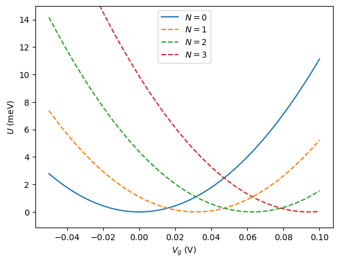
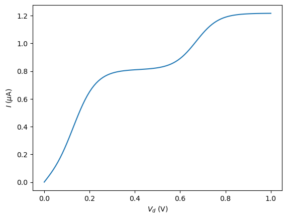
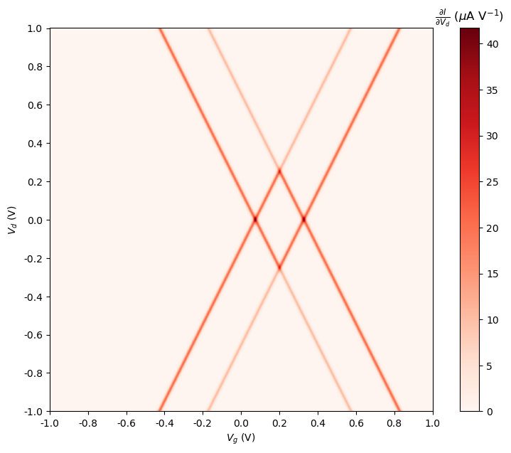
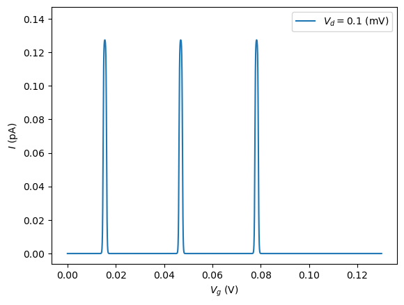
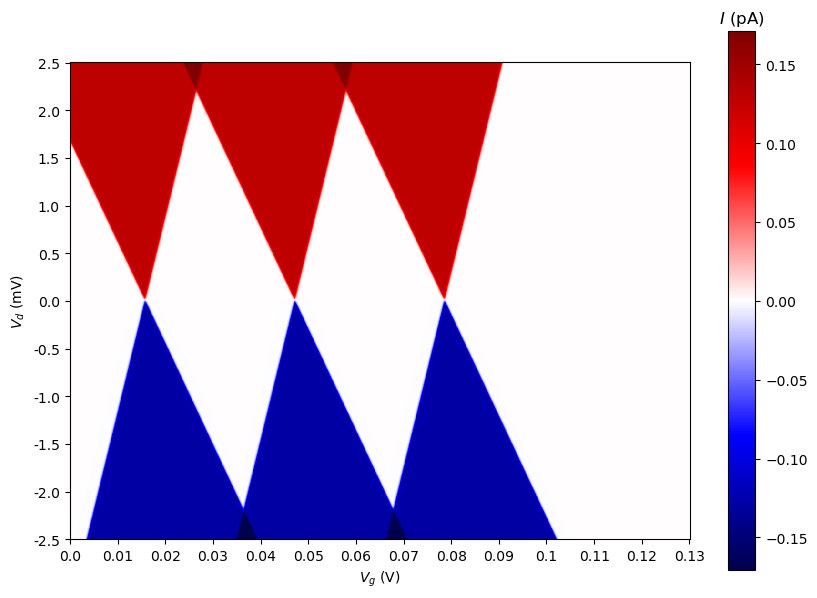
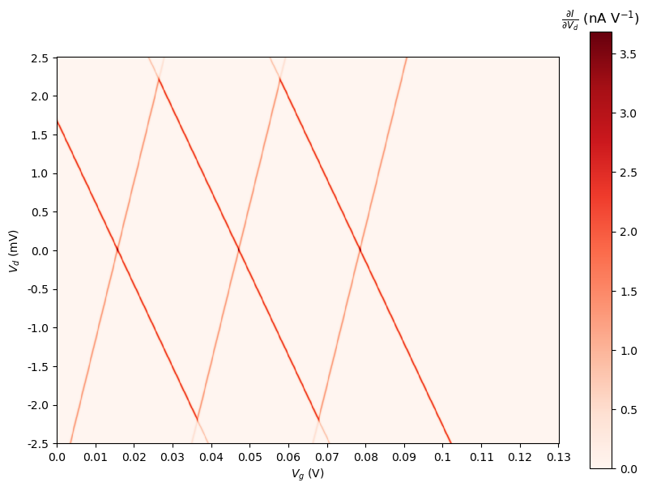
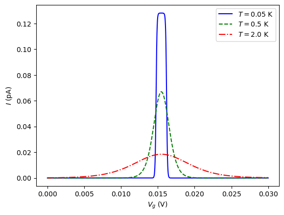

# Chapter 1: Introduction

## Confinement
In classical mechanics, dynamics of a body can never truly be constrained along some direction. In general, slight perturbations to the body's initial state can cause motion along any direction.

However, in the case of quantum mechanics, confinement along some direction is much stronger. For instance, a particle of mass $m$ trapped in a 3D box of dimensions $L_x, L_y, L_z$ has energy eigenvalues as
$$E_{n_x, n_y, n_z} = \frac{h^2}{8m} \left( \frac{n_x^2}{L_x^2} + \frac{n_y^2}{L_y^2} + \frac{n_z^2}{L_z^2} \right)$$
where $n_x, n_y, n_z$ represent the quantum numbers of the state.

Since the energy required to excite a degree of freedom is inversly proportional to the square of its size, if one of the dimensions is much smaller than the others, then that degree of freedom is effectively _frozen in_.  
Very large amounts of energy are required to cause excitations in that degree of freedom.

Based on this principle, structures such as 2D Electron Gas (2DEG) and 1D Quantum Wires can be formed, whose dynamics are constrained along some dimensions. Applying further constraints, we can achieve a zero-dimensional structure known as a Quantum Dot.

## Quantum Dots
As discussed earlier, a quantum dot is a zero-dimensional structure. Therefore, motional degrees of freedom are effectively locked in, and it's energy states can only be changed by changing the number of electrons and their interactions with external fields.

Due to the quantization of energy levels and tunneling through barriers, which shall be explored later, they have electrical properties which are very different from any classical component.

# Chapter 2: Model

A quantum dot can store electrons inside it. As such, when connected to a source and a drain, it can be assumed that it is connected capacitively to them.

For further control, the quantum dot is also capacitively coupled to a gate which can further alter the voltage on the dot.

If the number of electrons on the dot is $N$, then it can be shown that the total energy stored in the system is given by (for no external fields)
$$
\begin{align}
U(N) &= \sum_i{\frac{C_i \Delta V^2}{2}} \\
&= \frac{(-eN + C_g V_g + C_s V_s + C_d V_d)^2}{2 C_{\Sigma}}
\end{align}
$$
where $C_i$ and $V_i$ represent the capacitance and voltage to that part of the system. 
Further $C_{\Sigma} = C_g + C_s + C_d$, as they can be considered to be in parallel.

Note that under this model, the number of electrons can be found by considering the value of $N$ which minimizes $U$.

  
_Figure 1: Potential energy versus the gate voltage for various number of electrons. It can be observed how the most stable number of electrons change with the gate voltage._

When the same minimum potential is achieved for different values of $N$, the dot can transition between those two states to conduct electrons between the source and the drain.

The energy required to add an electron to the dot, i.e. the electrochemical potential, is therefore,
$$
\begin{align}
\mu (N) &= U(N) - U(N-1) \\
&=E_c \left( N - \frac12 - \frac{C_s V_s + C_g V_g + C_d V_d}{e} \right)
\end{align}
$$
where $E_c = \frac{e^2}{C_\Sigma}$ is the charging energy, and defines the typical energy scale of the system.

There exists a potential barrier between the source and the dot and between the dot and the drain through which electrons can tunnel through.  
We consider the tunneling rate to be proportional to the number of available states with aligned energies.

# Chapter 3: Results

## The Master Equation Approach

This approach considers the quantum dot to have certain rates of transitions from one state to another. Under steady state, the probability of being in a certain state must remain constant. As such, the expected value of the transition rates into and out of each state must be equal.

This can be written as
$$\sum_\alpha{R(\alpha \rightarrow \beta) P_\alpha} = \sum_\beta{R(\beta \rightarrow \alpha) P_\beta}$$
where $P_\alpha$ is the probability of being in state $\alpha$ and $R(\alpha \rightarrow \beta)$ represents the rate of transition from the state $\alpha$ to $\beta$.

Here, transistions are only permitted where a single electron tunnels into or out of the dot through either the source or the drain.

The rate of tunneling through a barrier is assumed to be 
$$\Gamma_i \cdot F_i(\mu(N))$$
where $\Gamma_i$ is a characteristic of the barrier and $F_i(\mu)$ is the Fermi-Dirac distribution.

The net current can be found by summing over all the tunnelling events taking place over a barrier.

## Dutta's Simulation

In this, we only consider the dot to hold upto two electron, where there exists a degenracy in the one electron state.  
When we apply the above procedures to this system, we obtain the following results.

  
_Figure 2: The current versus drain voltage reveals a mostly increasing behaviour with a flat regions in between due to saturation of current due to the available transistions._  

  
  
_Figure 3&4: The current and differential conductance for the quantum dot. When the drain voltage exceeds a certain threshold, there is always current flowing. For low drain voltages, the current is blocked at certain gate voltages due to misalignment of the drain-source voltage gap and available energy states in the dot._

## Paper 1 Simulation

In this simulation, we may consider an arbitrary number of electrons present in the quantum dot, with no degenracy due to spin.

As such, we may simulate the effects of having multiple states present within the drain-source voltage gap.  
However, for the purpose of plotting the graphs, an upper limit of 3 states has been taken.

  
_Figure 5: Current versus gate voltage showing peaks and zero-current regions depending on the alignment of the dot energy states with the source-drain voltage gap._  

  
  
_Figure 6&7: Very similar to the figures obtained in the Dutta simulation, however with further range due to increased number of maximum electrons_  

  
_Figure 8: Here, the effect of temperature on the broadening of the peaks can be seen, where electrons can cross the tunnel barrier due to their thermal energies._